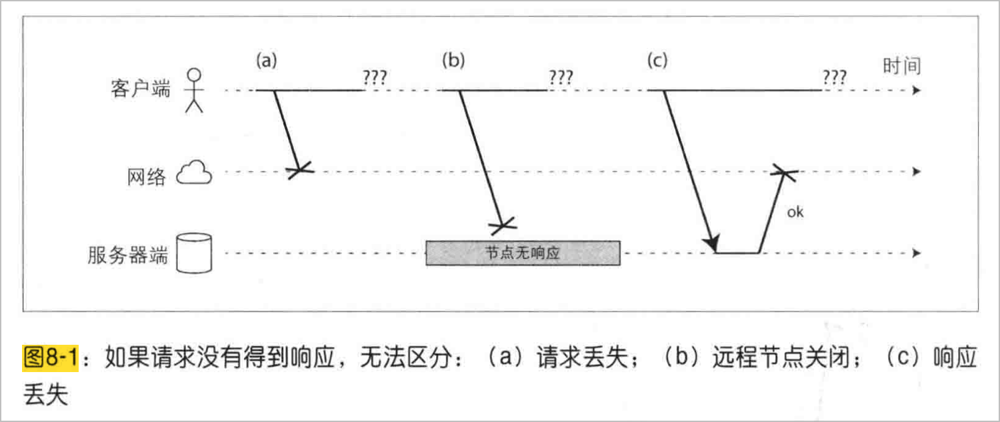
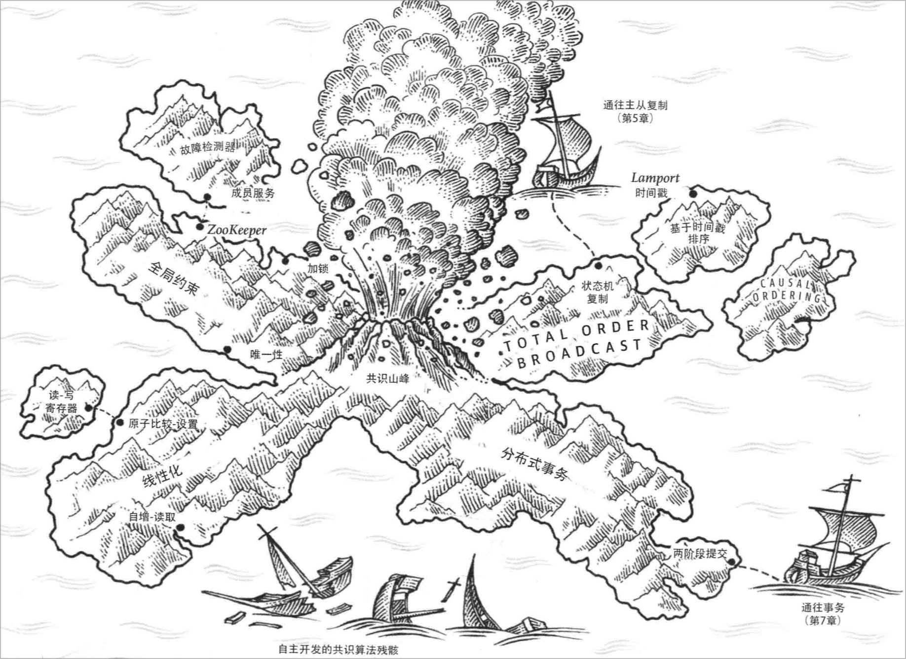
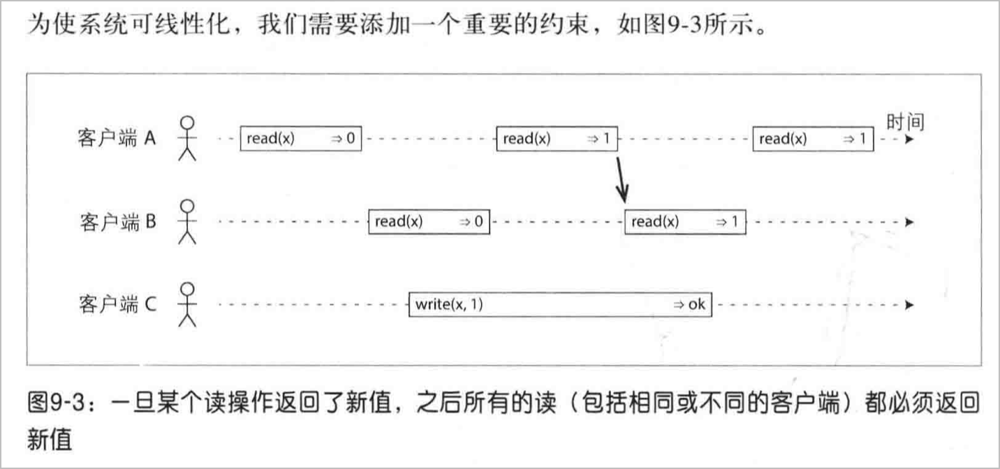
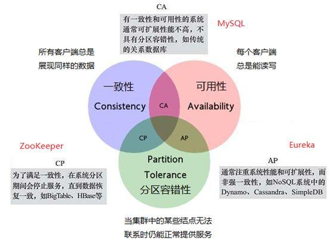

<!-- header:   -->
<!-- backgroundImage: url("https://gitee.com/sancppsancpp/marp_theme_xidian/raw/main/images/bg2.png") 
_backgroundImage: url("https://gitee.com/sancppsancpp/marp_theme_xidian/raw/main/images/bg.png") 
_paginate: false 
_class: cover_a -->

<THEME>《数据密集型应用系统设计》分享</THEME>

<NAME>田震雄</NAME>
<DATE>2023.11</DATE>

---

<!-- _class: mulu 
_header: "CONTENTS" 
_paginate: false  -->

# 数据密集型应用系统设计

<!-- 在此生成目录toc -->
- [《数据密集型应用系统设计》](#数据密集型应用系统设计)
  - [《DDIA》介绍](#ddia介绍)
  - [分布式系统中的麻烦事](#分布式系统中的麻烦事)
    - [部分失败](#部分失败)
    - [不可靠的网络](#不可靠的网络)
    - [不可靠的时钟](#不可靠的时钟)
    - [知识、真相和谎言](#知识真相和谎言)
  - [一致性与共识协议](#一致性与共识协议)
    - [一致性保证](#一致性保证)
    - [线性一致性（强一致性）](#线性一致性强一致性)
    - [CAP理论](#cap理论)
  - [后续](#后续)

<!-- 本次分享主要介绍第八章和第九章，也是我认为最有价值的两章 -->

## 《DDIA》介绍

<SJ>《DDIA》从“讨论存储在一台机器上的数据转向讨论分布在多台机器上的数据”主题出发，介绍了如何构建分布式系统，其中的困难和挑战以及解决理论。
<SJ>关于作者：Martin Kleppmann是英国剑桥大学分布式系统方向的研究员。此前，他曾是LinkedIn和Rapportive等互联网公司的软件工程师，负责大规模数据基础设施建设。在此过程中他遇到过一些困难，因此他希望这本书能够帮助读者避免重蹈覆辙。
<!-- 第一段是我个人的总结， -->

## 分布式系统中的麻烦事

对应《DDIA》的第八章

### 部分失败

<SJ>单机系统通常具有一种很好地特性：要么正常运行、要么出错崩溃，而不会处于一种中间状态。
<SJ>在分布式系统中，有很多我们习以为常的假设都不复存在，各种各样的异常问题都会出现。其中最令人难受的是：部分失败（partial failure），即系统的一部分正常工作，另一部分却以某种诡异的方式出错。
<SJ>解决思路：分布式系统中的链路都是不可靠的，需要软件兜底。“面向容错进行设计分布式系统”

### 不可靠的网络

<SJ>互联网和数据中心的内部网络多是异步封包网络（asynchronous packet networks）。在这种类型网络中，一个机器向其他机器发送数据包时，不提供任何保证：你不知道数据包什么时候到、甚至不知道它是否能够到。具体来说，当我们的应用发送网络请求后，可能会面临以下诸多情况：

- 请求没有发出去就丢了（比如你的网线可能被拔了）
请求可能先排了会队，稍后才被发出去（比如网络或接收方负载过高）
对端节点挂了（比如遇到异常宕机或者断电了）
对端节点临时无响应（比如正在进行 GC），但稍后又能正常工作
对端节点处理了你的请求，但应答在网络回程中丢了（比如网关配错了）
对端节点处理了你的请求，但应答被推迟了（比如网络或你的机器负载过高）

解决思路：设置超时时间$2d+t$；自动检测故障节点...

---

<!-- 图8.1展示了网络请求可能出问题的几个方面：请求没送到服务端；服务节点挂了；响应没送回客户端。8.2展示了视交通拥堵情况，两点间的通行时间可能会有很大差异。类似的，在计算机网络中，数据包的延迟大小也通常和排队相关，且有很多环节可能会造成排队： -->

### 不可靠的时钟

<!-- 之前遇到过最极端的案例，是服务部署在了不同的时区，导致日志的时间戳不是连续的。 -->
<!-- 图示是两个客户端向一个分布式数据库进行操作。Client A 向节点 1 写入 x = 1，然后该写入被复制到节点 3 上；Client B 在节点上将 x 增加 1，得到 x = 2；最终上述两个写入都被复制到节点 2。
所有节点只会通过时间戳递增的顺序接受同步过来的写入请求，如果某个写请求时间戳小于上一个写请求的，则丢弃。
但在这个例子中，却仍然出现了顺序问题，写请求 x = 1 的时间戳是 42.004，写请求 x = 2 的时间戳是 42.001，小于 x = 1 的写请求，但我们知道，写请求 x = 2 应该发生在后面。于是当节点 2 收到第二个写请求 x = 2 时，发现其时间戳小于上一个写时间戳，于是将其丢掉。于是，客户端 B 的自增操作在节点 2 上被错误的丢弃了。
人话：Node1上的时间比Node3慢2.5ms，当1&3的同步命令到达2时，虽然1的先发生，但是时间戳没2的快。
解决思路：全局自增事务ID
 -->

### 知识、真相和谎言

<P20><SJ>非对称故障：某个节点可以收到任何其他节点发送给他的信息，但其发出的消息却被丢弃或者延迟很高。此时，尽管该节点运行良好，并且能处理请求，但却无人能收到其响应。在经过某个超时阈值后，其他节点由于收不到其消息，会将其标记为死亡。
<P20><SJ>第一个场景，处于半连接的节点就像躺在棺材里被运向墓地，尽管他持续大喊：“我没有死”，但没有人能听到他的喊声，葬礼继续。
<P20><SJ>第二个场景，稍微不那么噩梦一些，这个处于半连接的节点意识到了他发出去的消息别人收不到，进而推测出应该是网络出了问题。但纵然如此，该节点仍然被标记为死亡，而它也没有办法做任何事情来改变，但起码他自己能意识到这一点。
<P20><SJ>第三个场景，假设一个节点经历了长时间的 GC，该节点上的所有线程都被中断长达一分钟，此时任何发到该节点的请求都无法被处理，自然也就无法收到答复。其他节点经过等待、重试、失掉耐心进而最终标记该节点死亡，然后将其送进棺材板。经过漫长的一分钟后，GC 完成，所有线程被唤醒从中断处继续执行。从该线程的角度来看，好像没有发生过任何事情。但是其他节点惊讶地发现棺材板压不住了，该节点恢复了健康，并且又开始跟旁边的人很开心的聊天了。

---

<P28><SJ>上述几个故事都表明，**任何节点都没法独自断言其自身当前状态**。一个分布式系统不能有单点依赖，因为单个节点可能在任意时刻故障，进而导致整个系统卡住，甚而不能恢复。
<SJ>因此，大部分分布式算法会基于一个法定人数，即让所有节点进行投票：任何决策都需要达到法定人数才能生效，以避免对单节点的依赖。

## 一致性与共识协议

对应《DDIA》第九章，讨论如何解决上述问题。

### 一致性保证

<SJ>大部分多副本数据库（replicated databases）提供最终一致性（eventually consistency）的保证，**这意味着，只要你对数据库停写，并等待足够长的时间，则所有对相同数据的读取请求最终会返回相同的结果**。从另一个角度来说，所有的不一致都是暂时的，最终都会被解决（当然，这得是在网络故障能最终修复的假设之下）。

### 线性一致性（强一致性）

<SJ>一个系统对外表现的像所有数据只有一个副本，作用于数据上的操作都可以原子地完成。有了这个保证，不管系统中实际上有多少副本，应用层都不用关心。

<SJ>这那什么情况下应该使⽤线性化呢？上⾯⾜球⽐赛⽐分的例⼦只是个最简单的情况，结果存在⼏秒的延迟通常不会造成实质的伤害。然⽽，在有些场景下，**线性化对于保证系统正确⼯作⾄关重要**。
<!-- 图9-1是⼀个⾮线性化的体育⽹站”。Alice和Bob坐在同⼀个房间⾥各⾃观看⾃⼰的⼿机，焦急地等待2014年FIFA世界杯决赛的结果。刚刚宣布了最终⽐分之后，Alice刷新了页⾯马上看到获胜者，然后兴奋地告诉Bob。于是Bob马上在⾃⼰的⼿机上刷新 页⾯，但他的请求发向了某个落后的数据库副本，结果却显⽰⽐赛还在进⾏之中。 -->

---
**如何实现线性一致性？**

<SJ>在⼀个可线性化的系统中，在写操作的开始与结束之间必定存在某个时间点，x的值发⽣了从0到1的跳变。如果某个客户端的读取返回了新值1，即使写操作尚未提交，那么所有后续的读取也必须全部返回新值。

---

**线性一致性的代价**

<SJ>当发生网络故障时，需要再线性一致性与系统可用性直接做出选择。如果应用层要求线性一致的读写，则数据中心间的网络中断会造成服务的不可用。

### CAP理论

* 如果应用层要求系统提供线性一致性，此时如果某些数据副本由于网络问题和系统其他部分断开了连接，则这些数据副本就不再能够正常地处理请求：要么等待网络恢复、要么进行报错。但这都意味着系统不可用。
* 如果应用不要求系统的线性一致，则即使多副本间遇到连接问题，每个副本可以独立的进行写入。从而，即使出现了网络故障，系统仍然能够保持可用，但其行为不是线性一致的。
* **结论(CAP理论)**：如果系统不提供线性一致性，就可以对网络故障更加鲁棒。（于 2000 年被 Eric Brewer 提出）
  今天更准确的描述：当网络出现分区时，一致性和可用性只能二选其一。

* 

---

问题：
- CP（强一致性，放弃高可用）、AP（高可用，弱一致性） 该怎么选择？
  * 
- CAP理论的不足。以及后人延伸出的BASE理论。
  * BASE是“Basically Available, Soft state, Eventually consistent(基本可用、软状态、最终一致性)”的首字母缩写。核心：应用可以采用适合的方式达到最终一致性。

## 后续

<SJ>《DDIA》后面讲解了如何保证分布式系统的执行顺序；分布式事务的实现（两阶段提交）与共识算法...

<!-- 后面的部分我个人还没有太看懂，怕我的理解不正确，就不分享了。 -->

---

