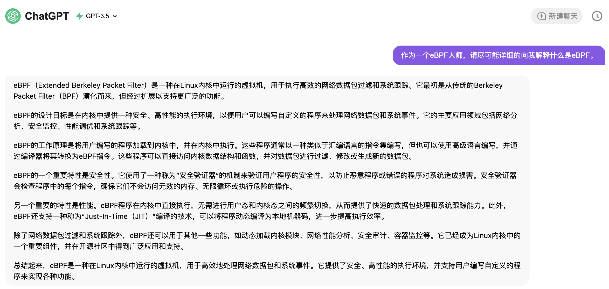
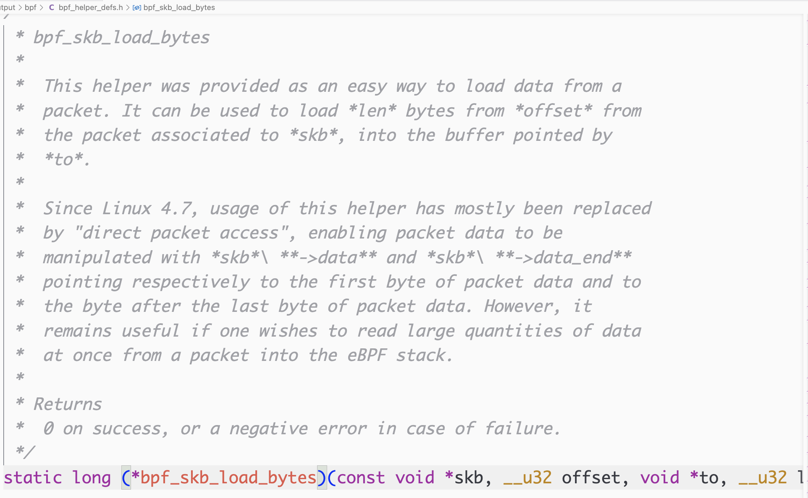
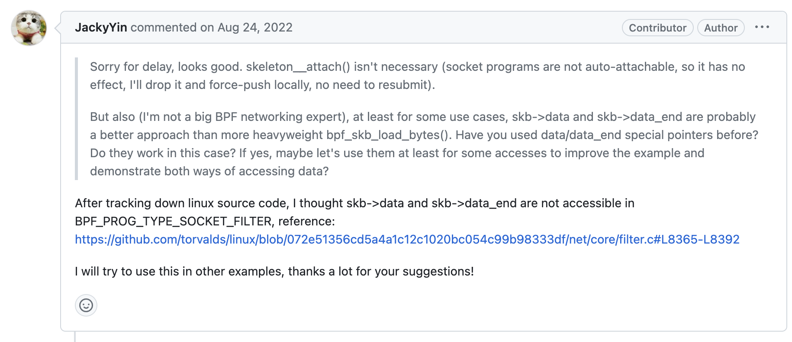
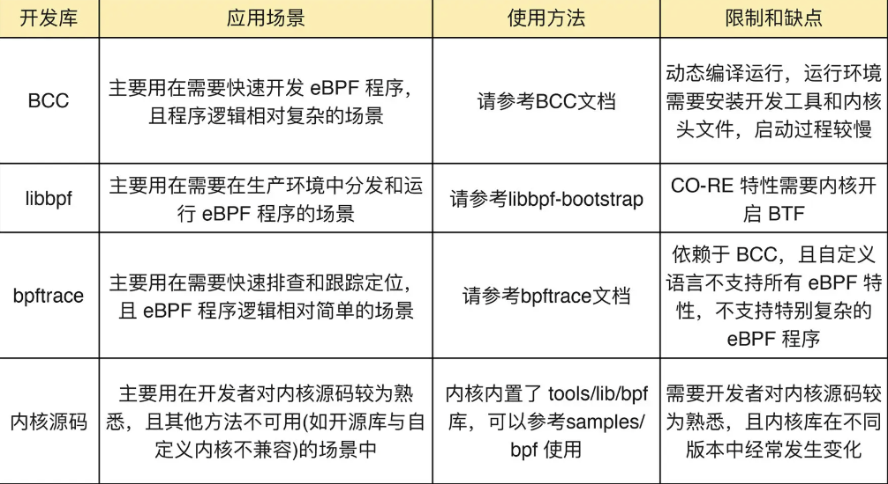
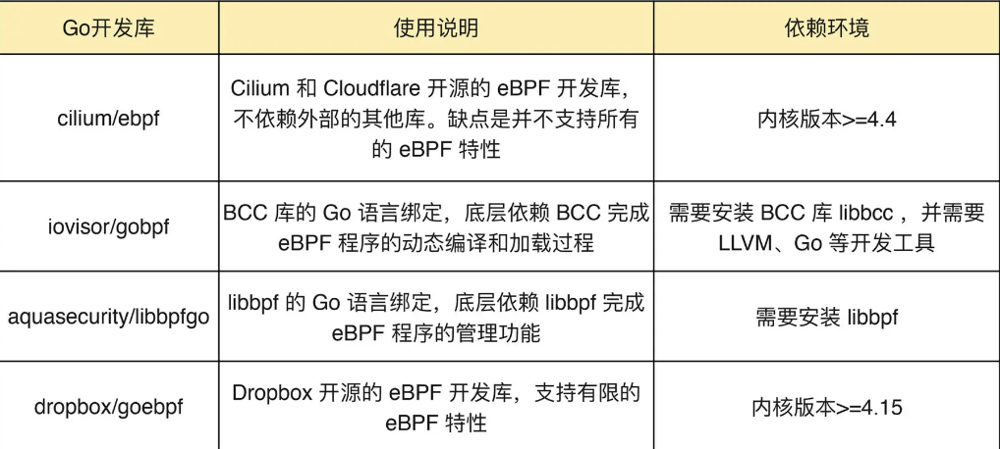
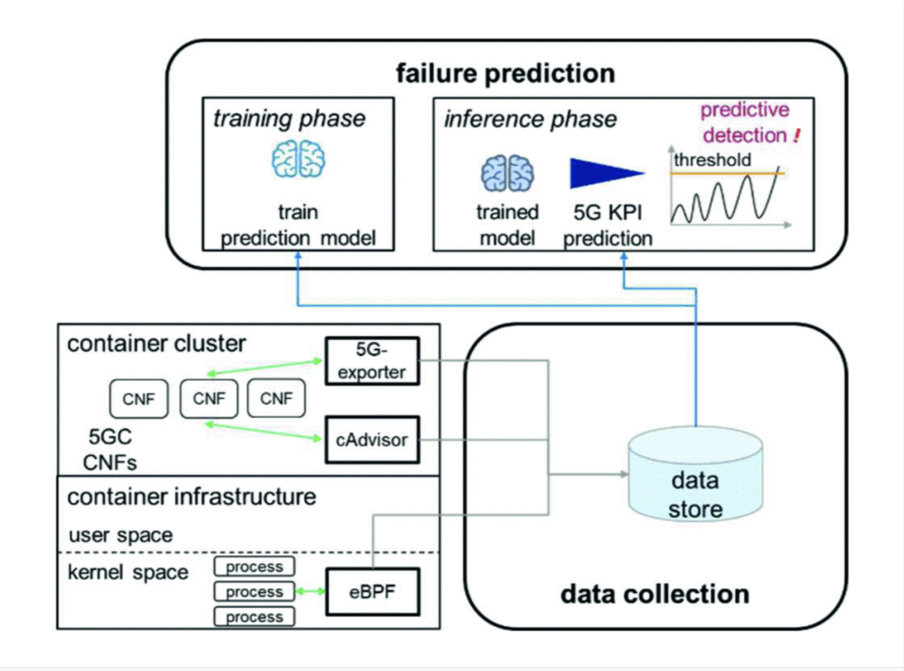
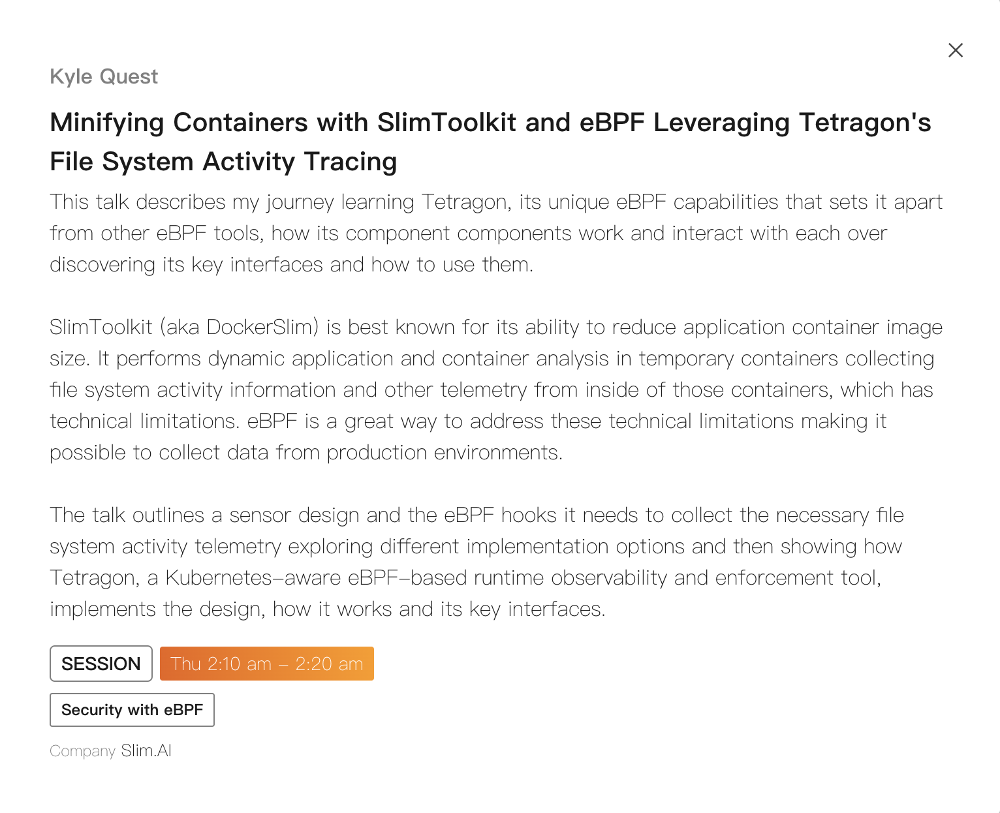

<!-- backgroundImage: url("../images/bg2.png")  -->

<!--
_backgroundImage: url("../images/bg.png")
_paginate: false  -->


# eBPF技术研讨
###### 田震雄
###### 2023.09

---

目录

* 什么是eBPF&&eBPF基本原理
  * ChatGPT给出的回复
  * bpf Syscall
  * eBPF Verifier
* eBPF的典型应用场景
* eBPF开源项目
  * Linux Kernel Source Code
  * BCC
  * falco-drivers
* eBPF开发工具&&如何选择
* 已有的书籍
* 已有的论文
* 总结

---

## 什么是eBPF&&eBPF基本原理

ChatGPT：


* 关键词：内核中虚拟机、用户自定义程序、安全高效。

---

Cilium架构，能够概括eBPF的运行机制：

<SJ>用户编写的C语言eBPF内核态程序，通过clang编译成eBPF字节码，由eBPF用户态程序（前端语言）调用**bpf系统调用**注入Linux内核运行。内核空间的eBPF内核态程序通过eBPF map与用户态程序进行数据交互。

---

<SJ>eBPF 程序是在内核中被事件触发的。在一些特定的指令被执行时，这些事件会在钩子处被捕获。钩子被触发就会执行 eBPF 程序，对数据进行捕获和操作。钩子定位的多样性正是 eBPF 的闪光点之一。例如下面几种：

- **系统调用： 当用户空间程序通过系统调用执行内核功能时。**
- **功能的进入和退出： 在函数退出之前拦截调用。**
- **网络事件： 当接收到数据包时。**
- **kprobe 和 uprobe： 挂载到内核或用户函数中。**


这里着重介绍eBPF中两个组件：bpf Syscall、bpf Verifier

---


### bpf syscall


用户态eBPF程序与内核交互的唯一路径是bpf系统调用：

```c
#include <linux/bpf.h>

int bpf(int cmd, union bpf_attr *attr, unsigned int size);
```

BPF 系统调用接受三个参数：

* cmd ，代表操作命令，比如`BPF_PROG_LOAD`就是加载eBPF程序。
* attr，代表 bpf_attr 类型的 eBPF 属性指针，不同类型的操作命令需要传入不同的属性参数。
* size ，代表属性的大小。

<SJ>bpf系统调用看似简单，但是包括了bpf的所有功能。在内核5.15中，第一个参数cmd支持37个宏定义命令：(https://elixir.bootlin.com/linux/v5.15/source/include/uapi/linux/bpf.h#L838)，包括map的创建、增删改查；加载eBPF程序。。。

---

在内核文档中的示例：

```cpp
int bpf_prog_load(enum bpf_prog_type type,..., const char *license) {
  union bpf_attr attr = {
    .prog_type = type,
    ...,
    .log_level = 1,
  };

  return bpf(BPF_PROG_LOAD, &attr, sizeof(attr));
}
//---------------
int bpf_create_map(enum bpf_map_type map_type,..., unsigned int max_entries)
{
  union bpf_attr attr = {.map_type = map_type,
                         .key_size = key_size,
                         .value_size = value_size,
                         .max_entries = max_entries};

  return bpf(BPF_MAP_CREATE, &attr, sizeof(attr));
}
```
可以看出，bpf程序在用户空间使用的`bpf_prog_load(),bpf_create_map()`都是`bpf()`系统调用的封装。

---

**strace追踪bpf系统调用：**

<!-- strace常用来跟踪进程执行时的系统调用和接收所接收的信号。strace可以跟踪到一个进程产生的系统调用，包括 参数，返回值，执行消耗的时间。 -->

通过参数`-ebpf`，能够过滤出bpf系统调用：

```shell
tzx@tzx:~/ebpf_monitor/libbpf/src$ sudo strace -ebpf ./network_monitor 
...
bpf(BPF_PROG_LOAD, {prog_type=BPF_PROG_TYPE_SOCKET_FILTER, insn_cnt=2, insns=0xfffff5ee6d18, license="GPL", log_level=0,
 log_size=0, log_buf=NULL, kern_version=KERNEL_VERSION(0, 0, 0), 
 prog_flags=0, prog_name="", prog_ifindex=0, expected_attach_type=BPF_CGROUP_INET_INGRESS, prog_btf_fd=0, 
 func_info_rec_size=0, func_info=NULL, func_info_cnt=0, line_info_rec_size=0, line_info=NULL, line_info_cnt=0, 
 attach_btf_id=0, attach_prog_fd=0}, 116) = 8
...
bpf(BPF_BTF_LOAD, {btf="\237\353\1\0\30\0\0\0\0\0\0\0\20\0\0\0\20\0\0\0\5\0\0\0\1\0\0\0\0\0\0\1"...,
btf_log_buf=NULL, btf_size=45, 
btf_log_size=0, btf_log_level=0}, 32) = 8
...
bpf(BPF_MAP_CREATE, {map_type=BPF_MAP_TYPE_RINGBUF, key_size=0, 
value_size=0, max_entries=4096, map_flags=0, inner_map_fd=0, 
map_name="ringbuf", map_ifindex=0, btf_fd=8, btf_key_type_id=0,
btf_value_type_id=0, btf_vmlinux_value_type_id=0, map_extra=0}, 72) = 9
libbpf: map 'ringbuf': created successfully, fd=9
...
load success.
bpf(BPF_OBJ_GET_INFO_BY_FD, {info={bpf_fd=9, info_len=88 => 80, 
info=0xfffff5ee6fd0}}, 16) = 0

^Cstrace: Process 31846 detached
```

利用strace追踪bpf系统调用，能够捕获到被追踪的eBPF程序进行了哪些bpf系统调用，还能看到具体的参数值以及返回值（文件描述符，可以用于上下文分析）。用于调试eBPF程序。

---

### eBPF verifier


* 加载 eBPF 程序的进程拥有所需的能力（权限）。除非启用了非特权 eBPF，否则只有特权进程才能加载 eBPF 程序。
* 程序不会崩溃或以其他方式损害系统。
* 程序始终运行到完成（即程序不会永远处于循环状态，阻碍进一步处理）。

---

举例：

<SJ>在`samples/c`目录中的socket filter程序解析数据包的时候使用了`bpf_skb_load_bytes`这个辅助函数，但是其文档中写道“内核版本4.7之后，可以直接通过`skb->data and skb->data_end`指针来解析”。
</SJ>


<SJ>我认为是这个示例代码实现的时间太早了（所以没有通过头尾指针直接取报头），并且在自己的eBPF代码中直接通过`skb->data & skb->data_end`指针的方式解析包头数据，报错。经过debug将问题定位在此处，此场景下不能使用`skb->data & skb->data_end`指针访问。

---

<SJ>带着疑问，我翻到了这个示例代码的PR（(https://github.com/libbpf/libbpf-bootstrap/pull/97)，提交时间为2022年7月），在阅读之后PR的评论之后得知了[原因](https://github.com/torvalds/linux/blob/072e51356cd5a4a1c12c1020bc054c99b98333df/net/core/filter.c#L8365-L8392):`sk_filter_is_valid_access`这个函数限制了sk_filter不能直接通过data&&data_end访问包。


这个例子展示了eBPF verifier的功能，以及其是如何发挥作用的。

---

## eBPF的典型应用场景

### 云原生网络

[Cilium - Cloud Native, eBPF-based Networking, Observability, and Security](https://cilium.io/)

[Calico Documentation | Calico Documentation (tigera.io)](https://docs.tigera.io/)

[Kindling - eBPF-based Cloud Native Monitoring tool (harmonycloud.cn)](http://kindling.harmonycloud.cn/)

### 安全
[Falco](https://falco.org/)

### trace

[iovisor/kubectl-trace](https://github.com/iovisor/kubectl-trace)

[旁观者 - eBPF技术强力驱动，无需CA证书即可捕获HTTPS/TLS明文数据包。 | eCapture](https://ecapture.cc/zh/)

---

## eBPF开源项目

> 开源项目作为优质的eBPF学习资源

### Linux Kernel Source Code

[bpf - samples/bpf - Linux source code (v5.15) - Bootlin](https://elixir.bootlin.com/linux/v5.15/source/samples/bpf)

### BCC

[iovisor/bcc: BCC - Tools for BPF-based Linux IO analysis, networking, monitoring, and more (github.com)](https://github.com/iovisor/bcc)

### falcosecurity/libs

[falcosecurity/libs: libsinsp, libscap, the kernel module driver, and the eBPF driver sources (github.com)](https://github.com/falcosecurity/libs)

---

## eBPF开发工具&&如何选择

### 开发工具选择
> 内核态程序一定是拿C语言实现的，用户态程序可以自由发挥。



还有最近比较火的Rust，我本人没太了解。

一篇中文博客，博主记录了其如何选择开发工具：[Linux监控指定进程的网络流量 - 简书 (jianshu.com)](https://www.jianshu.com/p/bbe886541edd)

---
## 已有的书籍

[bpf - 商品搜索 - 京东 (jd.com)](https://search.jd.com/Search?keyword=bpf&enc=utf-8&wq=bpf&pvid=0a8e5ec9bfce489fa2323b988dc9aa3e)


---

1. [《BPF之巅：洞悉Linux系统和应用性能(博文视点出品)》](https://item.jd.com/12769029.html)（正在读）
     1. 原作者是Linux性能优化大师 Brendan Gregg，火焰图的发明人、BCC/bpftrace等开源软件的主要贡献者，具有权威性。
     2. 译者就职于Facebook、字节跳动、谷歌等知名公司。其中刘晓舟在字节跳动主持构建了基于 eBPF 的大规模性能分析和网络监控诊断平台。
     3. 内容丰富，包括bpf基本原理+Linux性能分析方法+bpf用于CPU、内存、网络等各子模块的应用。
     
2. [《Linux内核观测技术BPF》](https://item.jd.com/12939760.html)
     1. 原作者的介绍：“David Calavera是Netlify的CTO。他是Docker的维护者，RunC，Go，BCC工具以及其他开源项目的贡献者。他以在Docker项目上的工作而闻名，构建和培育了Docker插件生态系统。大卫非常喜欢Flame Graphs和performance optimizations。”
     2. 书较薄，好读，易上手。
     3. **BUT**：[github link](https://github.com/bpftools/linux-observability-with-bpf)，仓库已经存档，作者表示需要重写。

---

3. [《Learning eBPF》](https://www.oreilly.com/library/view/learning-ebpf/9781098135119/?_gl=1*xy55vv*_ga*MTEwNDM1NTc4MS4xNjk0NzQ4OTE0*_ga_092EL089CH*MTY5NDc0ODkxNC4xLjAuMTY5NDc0ODkyMy41MS4wLjA.)
     1. 作者：(https://www.lizrice.com/)，Chief Open Source Officer with eBPF pioneers Isovalent, creators of the Cilium project,
     2. 最新的书，2023.3，还没有中译版。偏入门，文图并茂。
     3. [有配套的在线实验环境](https://play.instruqt.com/isovalent/invite/miht6dgdosp0/tracks/tutorial-getting-started-with-ebpf/challenges/hello-world/notes?auto_start=true&)

---
## 已有的成果
### [BCC](https://github.com/iovisor/bcc)
<SJ>BCC 是一个用于创建高效内核跟踪和操作程序的工具包，其中包括一些有用的工具和示例。BCC 使 BPF 程序更易于编写，它使用 C 语言编写内核仪器（包括 LLVM 的 C 语言封装），并使用 Python 和 lua 语言编写前端。总结：工具集+开发库。
以追踪调度为例：
* 找到可用的hook点
  * https://elixir.bootlin.com/linux/v5.15/source/include/trace/events/sched.h#L220
  * https://elixir.bootlin.com/linux/v5.15/source/kernel/sched/core.c#L6284
  * 发现内核调度函数的静态追踪点向外暴露了三个参数：`(bool preempt, struct task_struct * prev, struct task_struct * next)`
* 实现eBPF程序


---

```c
//https://github.com/iovisor/bcc/blob/master/libbpf-tools/cpudist.bpf.c
static int handle_switch(struct task_struct *prev, struct task_struct *next)
{
	u32 prev_tgid = BPF_CORE_READ(prev, tgid), prev_pid = BPF_CORE_READ(prev, pid);
	u32 tgid = BPF_CORE_READ(next, tgid), pid = BPF_CORE_READ(next, pid);
	u64 ts = bpf_ktime_get_ns();
  ...

	if (targ_offcpu) {
    //启用了offcpu过滤器，会存储prev进程的停止时间戳；然后更新next进程的统计信息（下一个task被调度策略唤醒了），即为next进程的offcpu time。
		store_start(prev_tgid, prev_pid, ts);//这里的函数名应更改为store_stop
		update_hist(next, tgid, pid, ts);
	} else {
    //保存了prev_task的开始时间戳，现在prev_task被调度走了，perv_task的开始时间戳与当前时间戳之差就是oncpu time。
		if (get_task_state(prev) == TASK_RUNNING)
			update_hist(prev, prev_tgid, prev_pid, ts);
		store_start(tgid, pid, ts);
	}
	return 0;
}

SEC("tp_btf/sched_switch")
int BPF_PROG(sched_switch_btf, bool preempt, struct task_struct *prev,
	     struct task_struct *next)
{
	return handle_switch(prev, next);
}
```
<SJ>上述代码为要注入内核的**内核态程序**（需要通过bpf Verifier、不能使用for...总之就是保证能稳定执行不会使内核panic），由**用户态程序**通过bpf Syscall进入内核。

---

### [Cilium](https://cilium.io/) 
<SJ>Cilium 是一种开源的云本地解决方案，用于提供、保护和观察工作负载之间的网络连接，并以革命性的内核技术 eBPF 为动力。AWS,Google,Bell,Adobe,Datadog,Gitlab等公司都有使用。传统的CNI工作依赖内核路由数据包的方式，而Cilium直接改变内核行为,从而提供近乎全能的功能（路由、负载均衡、安全、可观测...）。

图源：[Cilium官网](https://cilium.io/)


[字节跳动：eBPF 技术实践：加速容器网络转发，耗时降低60%+！](https://mp.weixin.qq.com/s?__biz=Mzg3Mjg2NjU4NA==&mid=2247483701&idx=1&sn=c99b7df5b8457f6d4f87fa18fea82eba)

---

### [ghOSt](https://research.google/pubs/pub50833/)
<SJ>Google2021年发表的论文，旨在将操作系统调度策略由用户端编程实现，通过eBPF技术动态载入内核。其成果对Google Snap and Google Search业务有落地，对特定的业务特征实施特定的内核调度策略。


---

### [Failure Prediction in Cloud Native 5G Core With eBPF-based Observability](https://ieeexplore.ieee.org/document/10200028)
<SJ>主要工作：利用 eBPF 在云原生 5GC 中提出了一种新的故障预测方法。在此方法中，大量细粒度的统计数据是通过eBPF获取的。


---

### [eBPF Summit 2023](https://ebpf.io/summit-2023-schedule/)
<SJ>Wed, 9/13 - Thu, 9/14/2023(UTC+08)，就在前几天，eBPF社区的年度总结，还在消化中。
* Mate：构建低开销的基于BPF的GPU性能分析工具
* Samsung：基于eBPF实现实时数据优先级（优先处理通话、游戏数据包）&增强5G移动热点（加强监控）。
* deepflow（[云杉网络](https://www.yunshan.net/products/deepflow.html)）：基于eBPF&webassembly实现零代码观测金融应用。
* [slim.ai](https://slimtoolkit.org/)：利用eBPF减小容器镜像体积。



---
## 总结
* eBPF是一个强大的工具，传统方式更改内核行为十分困难，但是ebpf可以动态载入代码进入内核。
* eBPF在网络、可观测性、追踪&性能分析、安全等方面已经有了很多应用。
* eBPF只是一个工具，能否熟练使用取决于使用者是否熟悉被hook的模块，能否选择合理的位置切入。
* 开源社区是学习eBPF的最好资源。


---
