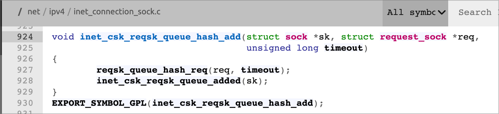
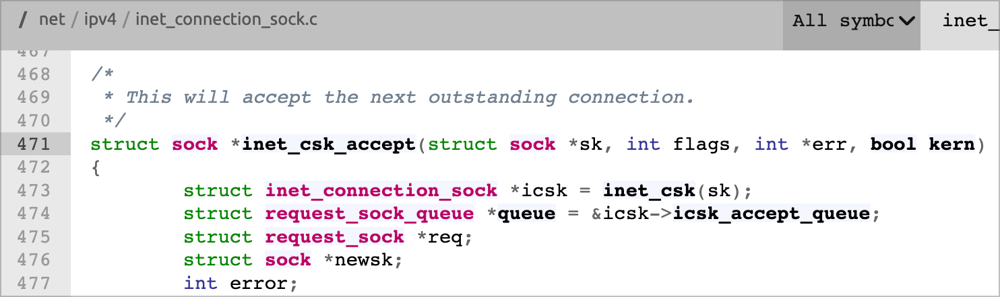
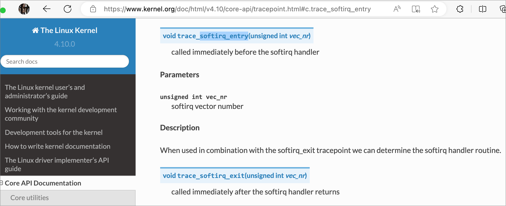
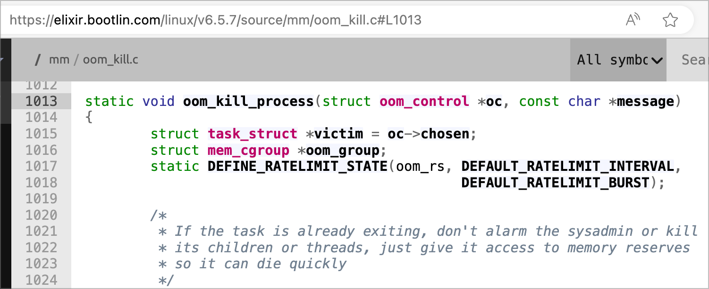

<!-- header:   -->
<!-- backgroundImage: url("../images/bg2.png")
_backgroundImage: url("../images/bg.png")
_paginate: false 
_class: cover_a -->

<THEME>ebpf_exporter</THEME>

<NAME>田震雄</NAME>
<DATE>2023.10</DATE>

---


<!-- _class: mulu -->
<!-- _header: "CONTENTS" -->
<!--_paginate: false  -->

<!-- 在此生成目录toc -->
- [1. 背景](#1-背景)
	- [1.1. node\_exporter](#11-node_exporter)
	- [1.2. cAdvisor](#12-cadvisor)
	- [1.3. ebpf\_exporter](#13-ebpf_exporter)
	- [1.4. 总结：](#14-总结)
- [2. 已有的示例功能](#2-已有的示例功能)
	- [2.1. bio\_latency\_seconds](#21-bio_latency_seconds)
	- [2.2. accept\_latency\_seconds](#22-accept_latency_seconds)
	- [2.3. softirqs\_total](#23-softirqs_total)
	- [2.4. oom\_kills\_total](#24-oom_kills_total)
	- [2.5. python\_function\_entries\_total](#25-python_function_entries_total)


# 1. 背景

## 1.1. node_exporter

<SJ>node_exporter采集数据的原理基本是读宿主机`/proc`虚拟文件系统的数据，数据粒度粗且不灵活。

[Source Code](https://github.com/prometheus/node_exporter/blob/7dd2f0dc4f632f7778be134ace0e7c8ecdfe279a/collector/cpu_linux.go#L338)：

```go
// updateStat reads /proc/stat through procfs and exports CPU-related metrics.
func (c *cpuCollector) updateStat(ch chan<- prometheus.Metric) error {
	stats, err := c.fs.Stat()
	if err != nil {
		return err
	}

	c.updateCPUStats(stats.CPU)

	// Acquire a lock to read the stats.
	c.cpuStatsMutex.Lock()
	defer c.cpuStatsMutex.Unlock()
	for cpuID, cpuStat := range c.cpuStats {
		cpuNum := strconv.Itoa(int(cpuID))
		ch <- prometheus.MustNewConstMetric(c.cpu, prometheus.CounterValue, cpuStat.User, cpuNum, "user")
		ch <- prometheus.MustNewConstMetric(c.cpu, prometheus.CounterValue, cpuStat.Nice, cpuNum, "nice")
		ch <- prometheus.MustNewConstMetric(c.cpu, prometheus.CounterValue, cpuStat.System, cpuNum, "system")
		ch <- prometheus.MustNewConstMetric(c.cpu, prometheus.CounterValue, cpuStat.Idle, cpuNum, "idle")
		ch <- prometheus.MustNewConstMetric(c.cpu, prometheus.CounterValue, cpuStat.Iowait, cpuNum, "iowait")
		ch <- prometheus.MustNewConstMetric(c.cpu, prometheus.CounterValue, cpuStat.IRQ, cpuNum, "irq")
		ch <- prometheus.MustNewConstMetric(c.cpu, prometheus.CounterValue, cpuStat.SoftIRQ, cpuNum, "softirq")
		ch <- prometheus.MustNewConstMetric(c.cpu, prometheus.CounterValue, cpuStat.Steal, cpuNum, "steal")

		if *enableCPUGuest {
			// Guest CPU is also accounted for in cpuStat.User and cpuStat.Nice, expose these as separate metrics.
			...
		}
	}

	return nil
}
```

<SJ>监控其他模块基本上和监控CPU的代码差不多，都是读取Linux各模块对外暴露的已有监控指标。[1.4. 总结：](#14-总结)

## 1.2. cAdvisor

> [https://github.com/google/cadvisor](https://github.com/google/cadvisor)

相较于node_exporter，基本原理没有改变。**容器的监控原理其实就是定时读取 Linux 主机上相关的文件并展示给用户。**
* 读取`/sys/fs/cgroup/`获取对容器的资源限制、CPU、内存使用情况
* 读取`/proc/$PID/net/dev`获取容器的网络情况


## 1.3. ebpf_exporter

ChatGPT给出的介绍：


---
<br>

eBPF Exporter的工作原理如下：
- 配置和启动：用户首先需要配置eBPF Exporter，指定要监控的eBPF程序和相关参数。然后，通过运行eBPF Exporter来启动该工具。
- 加载eBPF程序：eBPF Exporter会加载指定的eBPF程序到内核中。这可以通过使用libbpf库来完成，该库提供了一组API来加载和管理eBPF程序。
- 数据收集：一旦eBPF程序加载到内核中，它会开始捕获和处理指定的事件。例如，如果用户选择监控网络数据包，则eBPF程序可以在数据包到达网络协议栈之前捕获它们，并记录相关的指标信息，如数据包数量、协议类型等。
- 数据导出：eBPF Exporter会定期从内核中收集eBPF程序生成的指标数据。它可以使用libbpf库提供的API来访问内核中的eBPF映射表，从中读取指标数据。然后，eBPF Exporter将这些数据转换为Prometheus格式，并通过HTTP接口暴露给Prometheus服务器。
- Prometheus采集：Prometheus服务器会定期通过HTTP请求从eBPF Exporter获取指标数据。eBPF Exporter会将数据返回给Prometheus服务器，然后Prometheus会将这些数据存储在时间序列数据库中，以供后续查询和可视化使用。

<SJ>通过以上步骤，eBPF Exporter实现了对eBPF程序的监控和指标收集。用户可以使用Prometheus和其他相关工具来查询和分析这些指标数据，以了解系统的性能和行为。

## 1.4. 总结：
通过eBPF来采集数据与上述两种传统方案有本质区别

- 传统方案通过读虚拟文件系统采集数据，在一般情况下够用:
  - [node_exporter源码](https://github.com/prometheus/node_exporter/blob/7dd2f0dc4f632f7778be134ace0e7c8ecdfe279a/collector/cpu_linux.go#L338)
  - 
  - 上述案例解释了node_exporter的数据来源，基本原理。

---

<br> <br> <br> <br> <br>

* 传统方案的优点：
  * 程序实现足够简单，本质上就是`open("/proc/stat", O_RDONLY)`。
  * 稳定，理论上性能损耗极低。就是一个运行在用户态的读文件的程序。
* 传统方案的缺点：
  * 严重依赖于Linux实现：proc等虚拟文件系统对外提供的数据是固定的，能采集到什么数据、数据的粒度...**完全取决于Linux想给你看什么**。
  * 灵活性欠缺：因为能够采集到的数据是固定且有限的，所以很难将各子模块的数据进行关联，场景单一。无法将此时的CPU负载情况与内存、IO、网络相关联。
  * 数据类型不够丰富。

---

* eBPF方案，通过在内核中加载eBPF程序，在内核中动态的加载用户自定义的逻辑代码
* eBPF方案的优点：
  * 弥补了传统方案的缺点
    * 可编程，能够自定义采集数据的种类、粒度。
    * 能够从进程的角度，将采集到的数据关联起来。
  * eBPF的能力已经扩展到用户态，本质上用户态、内核态都是函数在运行。除了监控内核，还能监控用户态的程序。
    * 因为内核的代码是开源的，eBPF开发者能够获取被监控的代码，所以监控内核的eBPF工具用于监控内核不需要使用者做适配。而对于用户态的程序，eBPF开发者无法提前得知被监控的代码长什么样，也就很难做到无侵入性。
    * 对用户态的监控思路：不开刀（从进程的角度，监控进程的CPU、MEM、IO、NET...）；开刀（从代码的角度，直接获取函数的耗时、参数...**需要在编译时就引入**）
  * eBPF的能力远不止采集数据，**eBPF的一大亮点是能够更改内核行为**，后续能够提供强大的运维能力。
    * Cilium：基于eBPF的云原生网络方案。除了传统CNI的功能（数据包路由），还基于eBPF能力提供了LB、网关、访问策略、可观测性等功能。
    * XDP：网卡支持的功能，基于eBPF能够在网络包还未进入网络协议栈之前就处理（PASS、DROP、REDIRECT）。
    * [基于 eBPF 的云原生可观测性深度实践 - 云杉网络2023.3](https://www.infoq.cn/article/h1wowbgxk5y55eemdhze)

---

- eBPF方案的缺点：
  - 监控粒度与性能损耗成正比：监控粒度越细，性能损耗越高。
  - 编程难度较高。对内核子模块编写eBPF程序需要熟悉内核代码、函数执行流程。
  - 需要操作系统敏感权限，可能会伴生安全问题。
    - [Linux中基于eBPF的恶意利用与检测机制 - 美团技术团队2022.04](https://tech.meituan.com/2022/04/07/how-to-detect-bad-ebpf-used-in-linux.html)

```c
SEC("tracepoint/sock/inet_sock_set_state")
int inet_sock_set_state(struct trace_event_raw_inet_sock_set_state *args)
{
	__u64 ts, *start, delta_us, rx_b, tx_b;
	struct ident ident = {}, *identp;
	__u16 sport, dport, family;
	struct event event = {};
	struct tcp_sock *tp;
	struct sock *sk;
	bool found;
	__u32 pid;
	int i;

  ...

	sk = (struct sock *)BPF_CORE_READ(args, skaddr);
	if (BPF_CORE_READ(args, newstate) < TCP_FIN_WAIT1) {
		ts = bpf_ktime_get_ns();
		bpf_map_update_elem(&birth, &sk, &ts, BPF_ANY);
	}


	if (BPF_CORE_READ(args, newstate) != TCP_CLOSE)
		return 0;

	tp = (struct tcp_sock *)sk;
	rx_b = BPF_CORE_READ(tp, bytes_received);
	tx_b = BPF_CORE_READ(tp, bytes_acked);

	event.ts_us = ts / 1000;
	event.span_us = delta_us;
	event.rx_b = rx_b;
	event.tx_b = tx_b;
	event.pid = pid;
	event.sport = sport;
	event.dport = dport;
	event.family = family;
	if (!identp)
		bpf_get_current_comm(event.comm, sizeof(event.comm));
	else
		bpf_probe_read_kernel(event.comm, sizeof(event.comm), (void *)identp->comm);
	if (family == AF_INET) {
		bpf_probe_read_kernel(&event.saddr, sizeof(args->saddr), BPF_CORE_READ(args, saddr));
		bpf_probe_read_kernel(&event.daddr, sizeof(args->daddr), BPF_CORE_READ(args, daddr));
	} else {	/*  AF_INET6 */
		bpf_probe_read_kernel(&event.saddr, sizeof(args->saddr_v6), BPF_CORE_READ(args, saddr_v6));
		bpf_probe_read_kernel(&event.daddr, sizeof(args->daddr_v6), BPF_CORE_READ(args, daddr_v6));
	}
	bpf_perf_event_output(args, &events, BPF_F_CURRENT_CPU, &event, sizeof(event));

cleanup:
	bpf_map_delete_elem(&birth, &sk);
	bpf_map_delete_elem(&idents, &sk);
	return 0;
}

```

追踪TCP生命周期的eBPF程序示例

<!-- 上面的数据结构都是来自于内核，开发者需要对内核子模块足够熟悉 -->

# 2. 已有的示例功能

> https://github.com/cloudflare/ebpf_exporter/tree/master/examples

|   类型    |             已有功能              |                                      说明                                       |
| :-------: | :-------------------------------: | :-----------------------------------------------------------------------------: |
| histogram |      accept_latency_seconds       |           Latency histogram for how long sockets sit in accept queue            |
| histogram |        bio_latency_seconds        |                           Block IO latency histogram                            |
|  counter  | bpf_jit_pages_currently_allocated |                  Current number of pages allocated for bpf jit                  |
|  counter  |       page_cache_ops_total        |                      Page cache operation counters by type                      |
|  counter  |   cgroup_sched_migrations_total   |              Number of sched:sched_migrate_task events per cgroup               |
|  counter  |   icmp4_received_packets_total    |                    Number of icmp packets received over IPv4                    |
|  counter  |   icmp6_received_packets_total    |                    Number of icmp packets received over IPv6                    |
|  counter  |          kfree_skb_total          |         Number of calls into skb:kfree_skb with a per-reason breakdown          |
|  counter  |       llc_references_total        |                       Last level cache operations by type                       |
|  counter  |         llc_misses_total          |                       Last level cache operations by type                       |
|  counter  |          oom_kills_total          |                       Count global and cgroup level OOMs                        |
|  counter  |  pci_user_read_config_ops_total   |                  The number of operations reading pci configs                   |
|  counter  |          softirqs_total           |                      Total number of softirq calls per cpu                      |
|  counter  |      raw_timer_starts_total       |                           Timers fired in the kernel                            |
| histogram |    shrink_node_latency_seconds    |                     Latency histogram for shrink_node calls                     |
|  counter  |          syscalls_total           |                    Total number of executed syscalls by name                    |
| histogram |          tcp_syn_backlog          |                              TCP SYN backlog size                               |
|  counter  |      tcp_window_clamps_total      |           Number of times that TCP window was clamped to a low value            |
|  counter  |        timer_starts_total         |                           Timers fired in the kernel                            |
|  counter  |   udp_fail_queue_rcv_skbs_total   | Total number of UDP SKBs that failed to be delivered due to full receive buffer |
| histogram |        unix_socket_backlog        |                            Unix socket backlog size                             |
|  counter  |      libc_malloc_calls_total      |                     Number of libc malloc calls per cgroup                      |
|  counter  |   python_function_entries_total   |            Number of python:function__entry USDT calls per function             |
|  counter  |    xdp_incoming_packets_total     |             Incoming packets going through xdp by protocol and port             |


---

|  类型  |             已有功能              |                      说明                       |
| :----: | :-------------------------------: | :---------------------------------------------: |
| 直方图 |      accept_latency_seconds       |        接受队列中套接字等待的延迟直方图         |
| 直方图 |        bio_latency_seconds        |              块输入输出延迟直方图               |
| 计数器 | bpf_jit_pages_currently_allocated |            当前为bpf jit分配的页面数            |
| 计数器 |       page_cache_ops_total        |         按类型统计的页面缓存操作计数器          |
| 计数器 |   cgroup_sched_migrations_total   |  按cgroup统计的sched:sched_migrate_task事件数   |
| 计数器 |   icmp4_received_packets_total    |           通过IPv4接收的icmp数据包数            |
| 计数器 |   icmp6_received_packets_total    |           通过IPv6接收的icmp数据包数            |
| 计数器 |          kfree_skb_total          |        按原因分类的skb:kfree_skb调用次数        |
| 计数器 |       llc_references_total        |          按类型统计的最后一级缓存操作           |
| 计数器 |         llc_misses_total          |          按类型统计的最后一级缓存操作           |
| 计数器 |          oom_kills_total          |            统计全局和cgroup级别的OOM            |
| 计数器 |  pci_user_read_config_ops_total   |              读取pci配置的操作次数              |
| 计数器 |          softirqs_total           |             每个cpu的软中断调用次数             |
| 计数器 |      raw_timer_starts_total       |               内核中触发的定时器                |
| 直方图 |    shrink_node_latency_seconds    |           shrink_node调用的延迟直方图           |
| 计数器 |          syscalls_total           |          按名称统计的执行系统调用次数           |
| 直方图 |          tcp_syn_backlog          |               TCP SYN等待队列大小               |
| 计数器 |      tcp_window_clamps_total      |            TCP窗口被限制到低值的次数            |
| 计数器 |        timer_starts_total         |               内核中触发的定时器                |
| 计数器 |   udp_fail_queue_rcv_skbs_total   |    因为接收缓冲区满而无法投递的UDP SKBs总数     |
| 直方图 |        unix_socket_backlog        |             Unix套接字等待队列大小              |
| 计数器 |      libc_malloc_calls_total      |        按cgroup统计的libc malloc调用次数        |
| 计数器 |   python_function_entries_total   | 按函数统计的python:function__entry USDT调用次数 |
| 计数器 |    xdp_incoming_packets_total     |       按协议和端口统计通过xdp进入的数据包       |
<!-- 时间有限，针对操作系统的四个主要的子模块IO、网络、CPU、内存，各调一个进行介绍 -->

## 2.1. bio_latency_seconds


上图展示了在生产环境下更换了硬盘，传统方法采集到的数据 vs eBPF采集的数据。

---

- 与node_exporter相比有绝对优势：
   - 
- 数据粒度更细，能够精准的表达出系统状态。
   - 


## 2.2. accept_latency_seconds


跟踪socket在TCP连接通过队列的延迟，生成一个直方图。

---

使用了两个探针：

- 第一个探针 "inet_csk_reqsk_queue_hash_add" 在将新的 TCP 连接请求添加到监听队列时触发。它的目的是记录连接请求的开始时间。
  - 
- 第二个探针 "inet_csk_accept" 在接受新的 TCP 连接时触发。它的主要目的是计算连接的延迟，并将延迟数据存储到 "accept_latency_seconds" 哈希映射中。
  - 

一个是socket入队函数、一个是socket出队函数。通过捕获函数参数+时间戳记录。

## 2.3. softirqs_total
统计每个 cpu 的软中断调用总数
```c
SEC("tp_btf/softirq_entry")
int BPF_PROG(softirq_entry, unsigned int vec_nr)
{
    increment_map(&softirqs_total, &vec_nr, 1);
    return 0;
}
//------------------
// https://elixir.bootlin.com/linux/v5.15/source/kernel/softirq.c#L557
asmlinkage __visible void __softirq_entry __do_softirq(void)
{
	unsigned long end = jiffies + MAX_SOFTIRQ_TIME;
	unsigned long old_flags = current->flags;
	int max_restart = MAX_SOFTIRQ_RESTART;
	struct softirq_action *h;
	bool in_hardirq;
	__u32 pending;
	int softirq_bit;

		...
		trace_softirq_entry(vec_nr);
		...
}
```


<!-- 软中断被调用时的入口，还可以通过hook调度函数 -->

## 2.4. oom_kills_total



```c
SEC("kprobe/oom_kill_process")
int BPF_KPROBE(kprobe__oom_kill_process, 
struct oom_control *oc, const char *message)
{
    u64 cgroup_id = 0;
    struct mem_cgroup *mcg = BPF_CORE_READ(oc, memcg);
    if (mcg) {
        cgroup_id = BPF_CORE_READ(mcg, css.cgroup, kn, id);
    }
		...
    return 0;
}
```

<!-- 内存子模块在很多情况下都是系统运行的瓶颈。好消息是，eBPF在内存子模块中能发挥较大作用。本质上理解，hook内核中的内存申请&释放函数，就能知道内存子系统对用户提供的所有信息 -->


## 2.5. python_function_entries_total

> https://docs.python.org/3/howto/instrumentation.html#available-static-markers

```c
#include <vmlinux.h>
#include <bpf/bpf_helpers.h>
#include <bpf/usdt.bpf.h>
#include "bits.bpf.h"
#include "maps.bpf.h"

struct call_t {
    char module[128];
    char function[128];
};

struct {
    __uint(type, BPF_MAP_TYPE_HASH);
    __uint(max_entries, 1024);
    __type(key, struct call_t);
    __type(value, u64);
} python_function_entries_total SEC(".maps");

SEC("usdt/python3:python:function__entry")
int BPF_USDT(do_count, void *arg0, void *arg1, void *arg2)
{
    struct call_t call = {};
    bpf_probe_read_user_str(&call.module, sizeof(call.module), arg0);
    bpf_probe_read_user_str(&call.function, sizeof(call.function), arg1);

    increment_map(&python_function_entries_total, &call, 1);

    return 0;
}

char LICENSE[] SEC("license") = "GPL";
```

<!-- 这个例子作为一个eBPF作用域用户空间的样例，eBPF能够监控用户态的函数，这里是python运行时的function_entry调用点。基于此能力，可以做到微服务的语言层面的定向监控。例如对python实例、Java实例定制监控，最为典型的是收集Java的GC情况。我本科毕设就是探索了一下eBPF作用于golang微服务，最后达到的效果是需要额外维护一份配置文件，指明微服务主进程的函数入口地址、容器ID等信息，就能达到被监控程序无感知的监控。 -->

---

